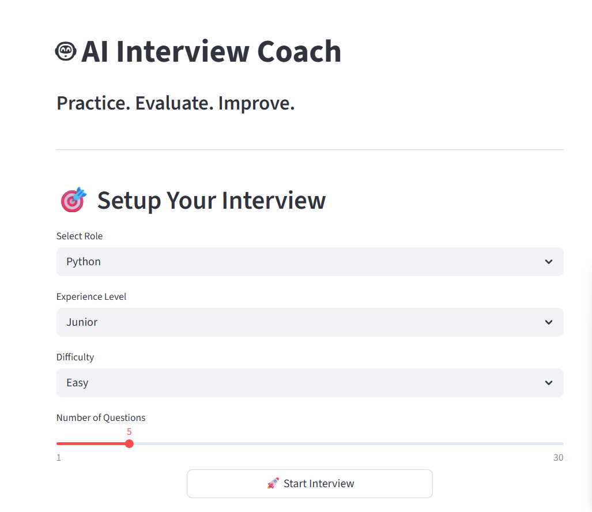
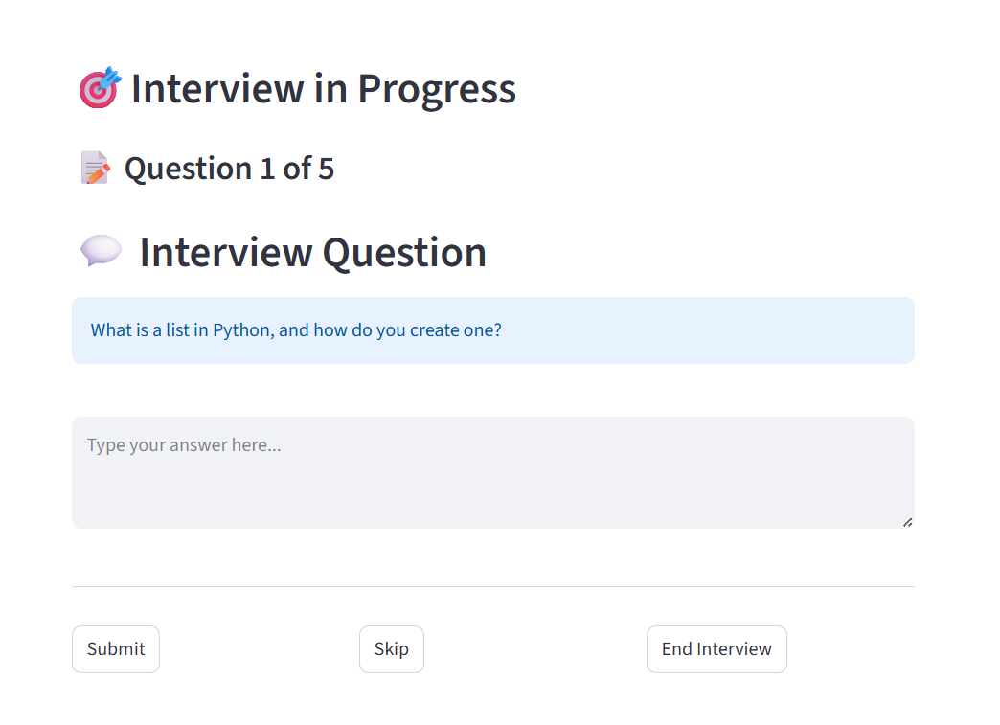
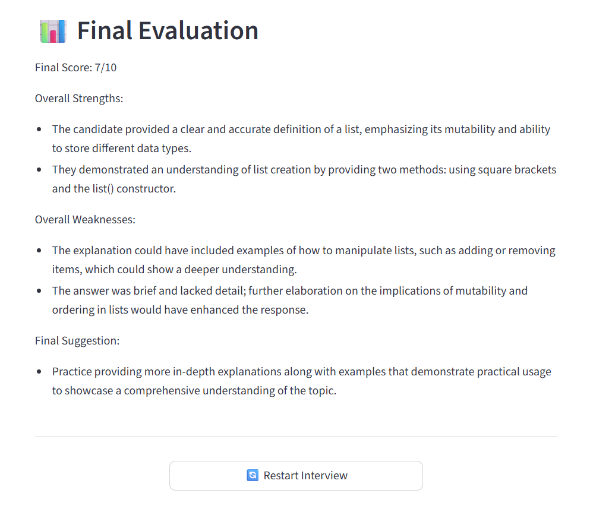

# 🤖 AI Interview Coach

AI Interview Coach is an LLM-powered interview preparation platform that helps users practice technical and HR interviews using AI-generated questions and instant performance evaluation.

The application simulates a real interview environment where users can select their preferred role, difficulty level, and experience level to practice interviews interactively.

---

# 🚀 Features

- AI-generated interview questions
- Multiple interview role support
- Difficulty level selection
- Experience level selection
- Real-time interview workflow
- AI-based interview evaluation
- Skip question functionality
- End interview anytime
- Restart interview feature
- Interactive Streamlit UI
- Dynamic question generation
- Session state management

---

# 📌 Supported Roles

- Python
- AI/ML
- Frontend
- Backend
- Full Stack
- Data Analyst
- HR

---

# 🛠️ Tech Stack

## Frontend
- Streamlit

## Backend
- Python

## AI / LLM
- OpenAI API
- Prompt Engineering

---

# ⚙️ Installation & Setup

## 1️⃣ Clone the Repository

```bash
git clone <your-github-repo-link>
```

## 2️⃣ Navigate to Project Folder

```bash
cd ai-interview-coach
```

## 3️⃣ Create Virtual Environment

### Windows

```bash
python -m venv venv
```

Activate virtual environment:

```bash
venv\Scripts\activate
```

---

## 4️⃣ Install Dependencies

```bash
pip install -r requirements.txt
```

---

## 5️⃣ Add Environment Variables

Create a `.env` file and add:

```env
OPENAI_API_KEY=your_api_key_here
```

---

## 6️⃣ Run the Application

```bash
streamlit run UI.py
```

---

# 🎯 How It Works

1. Select interview role
2. Choose experience level
3. Select difficulty level
4. Start AI interview
5. Answer AI-generated questions
6. Receive AI-based evaluation
7. Restart interview anytime

---

# 📷 Project Screenshots

## Setup Screen


## Interview Screen


## Evaluation Screen


---

# 🔮 Future Improvements

- Voice-based interviews
- Score dashboard
- Interview history tracking
- PDF report generation
- Authentication system

---

# 📂 Project Structure

```bash
ai-interview-coach/
│
├── UI.py
├── app.py
├── requirements.txt
├── .env
└── README.md
```
---
# 🌐 Live Demo

[https://your-app-name.streamlit.app](https://ai-interview-coach-mansijaysingh.streamlit.app/)

---

# 👩‍💻 Developer

## Mansi Singh

Aspiring AI Developer passionate about building AI-powered applications using Python, LLMs, and Generative AI.

---

# ⭐ If You Like This Project

Give this repository a star ⭐
